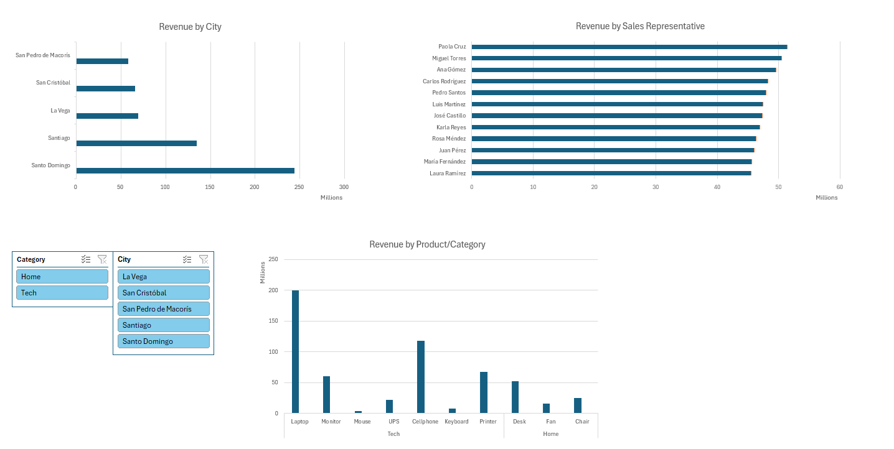
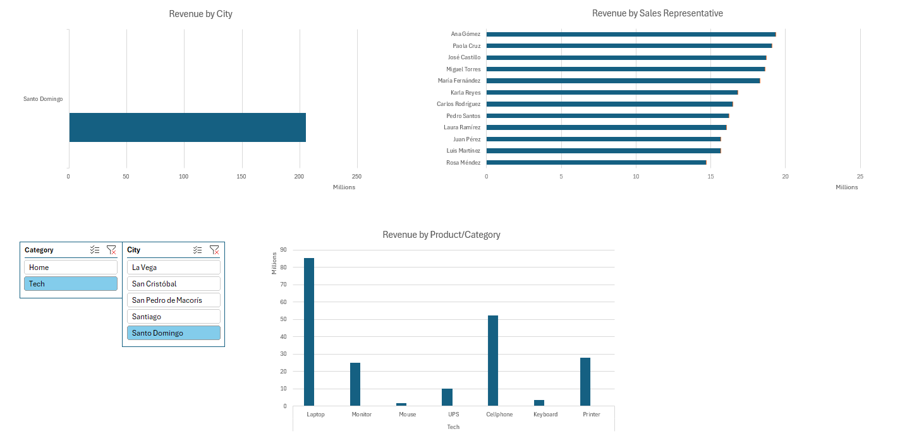
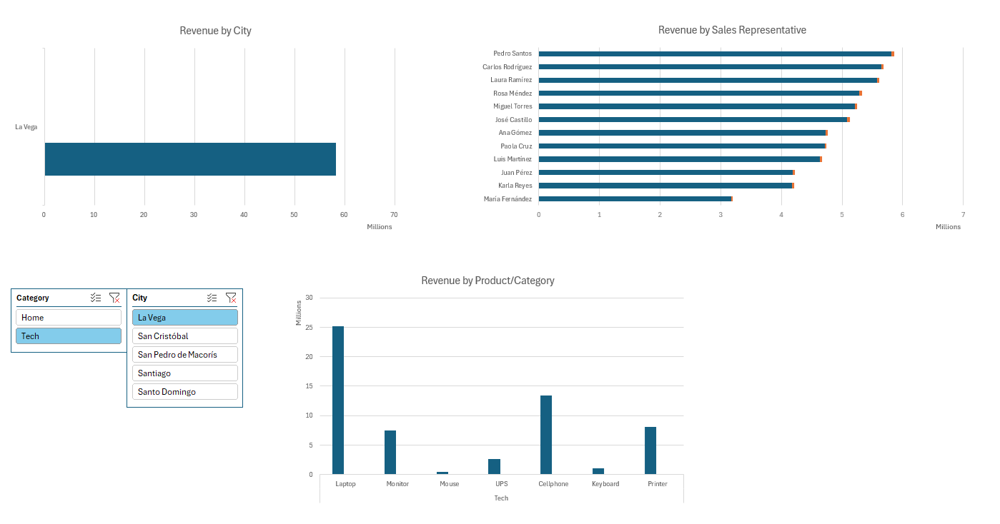
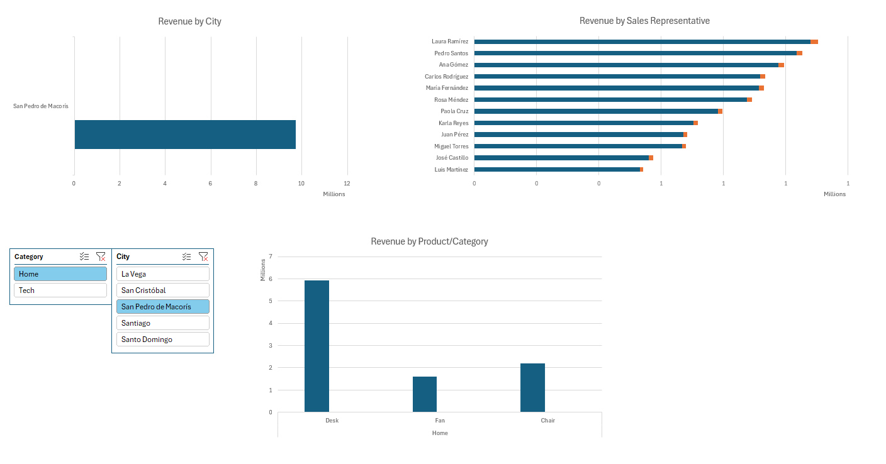
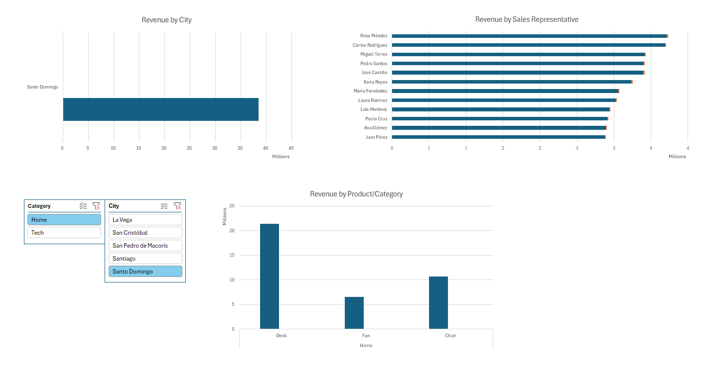

# 📊 Retail Sales Performance Analysis

## 🎯 Project Objective
Transform a raw dataset of 20,000+ sales transactions into an interactive, executive-level decision-making tool. This analysis identifies consumer patterns, sales force efficiency, and geographic revenue distribution for the 2026 period.

## 📈 Dashboard Preview
 
 
 
 
 

## 🛠️ Technical Stack
* **Microsoft Excel:** Primary analytics engine.
* **Power Query (ETL):** Automated data cleaning, normalization, and localization (Spanish to English).
* **Data Modeling:** Multidimensional Pivot Tables (Sum, Count, Average).
* **UI/UX Design:** Dynamic Dashboard featuring cross-functional Slicers and executive-level visualization.

## 🔍 Methodology & Technical Challenges
### 1. Robust ETL Pipeline
One of the key technical achievements was using **Power Query** to translate and clean the data. This ensures that if new raw data is added in the future, the entire dashboard updates with a single click, maintaining the English localization automatically.

### 2. Data Integrity
Ensured a consistent **Average Order Value (AOV)** across all pivot dimensions by avoiding manual calculations and utilizing native Value Field Settings. This guarantees the numbers are 100% accurate regardless of the filters applied.

## 💡 Key Business Insights
* **Category Dominance:** The **Tech** category accounts for over 80% of total revenue, driven primarily by Laptop sales (~$200M).
* **Geographic Concentration:** **Santo Domingo** represents 42% of the market share, highlighting it as the primary economic hub.
* **Sales Efficiency:** Performance is balanced across the team, with **Paola Cruz** and **Miguel Torres** leading in total revenue generation.

---
*Note: This workbook is optimized for executive viewing. Raw data and pivot calculations are hidden to maintain a clean user experience.*
